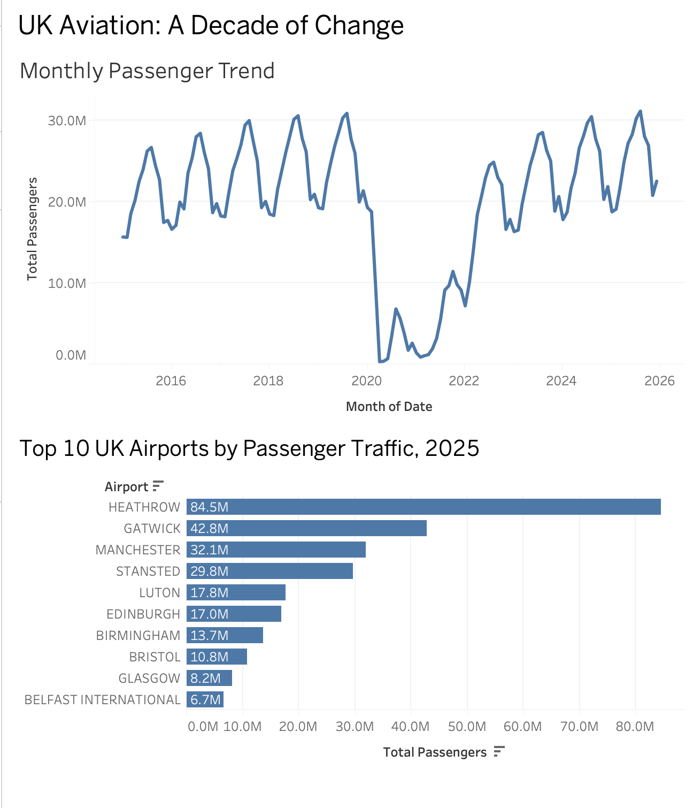

# UK Aviation: A Decade of Change

## Project Overview

This project analyses passenger traffic at UK airports over the period 2015–2025 using official UK Civil Aviation Authority (CAA) data.

The analysis explores how UK aviation changed over the decade, including long-term passenger growth, the impact of the COVID-19 pandemic, the subsequent recovery, differences between major UK airports, and seasonal patterns in passenger demand.

The project combines Python-based data preparation and exploratory analysis, time-series forecasting, SQL analysis, and an interactive Tableau dashboard.

## Business Question

**What has happened to passenger traffic at UK airports over the last decade?**

To answer this question, the analysis focuses on:

- How total UK airport passenger traffic changed between 2015 and 2025.
- The scale of the COVID-19 disruption and subsequent recovery.
- Which UK airports handled the most passengers in 2025.
- Which major airports have grown or declined compared with 2019.
- Seasonal patterns in monthly passenger traffic.
- Whether recent passenger traffic can be forecast using simple time-series models.

## Data

The project uses official monthly airport statistics published by the UK Civil Aviation Authority (CAA), specifically **Table 09 – Terminal and Transit Passengers**.

The dataset covers **January 2015 to December 2025**, providing 132 months of passenger data across UK reporting airports.

The analysis uses:

- Terminal passengers
- Transit passengers
- Total passengers
- Reporting airport
- Airport group
- Reporting month

Non-UK reporting airports in the Crown Dependencies (Alderney, Guernsey, Isle of Man and Jersey) are excluded from the main UK analysis.

Passenger totals represent activity reported by airports rather than unique individual travellers. For example, a domestic passenger may be counted at both the departure and arrival airports.

## Tools and Technologies

- **Python** — data cleaning, transformation and exploratory data analysis
- **pandas** — data manipulation and aggregation
- **Matplotlib** — data visualisation
- **statsmodels** — Holt-Winters time-series forecasting
- **SQLite / SQL** — querying and analysing the cleaned passenger dataset
- **Tableau** — interactive dashboard and data visualisation
- **Jupyter Notebook** — analysis and documentation
- **Git & GitHub** — version control and project portfolio

## Key Findings

- UK airport passenger traffic increased from **251.6 million in 2015 to 296.9 million in 2019**, an increase of approximately **18%**.
- The COVID-19 pandemic caused an unprecedented collapse in passenger traffic. In **April 2020**, UK airports handled only **0.3 million passengers**, compared with **24.7 million in April 2019**, a fall of approximately **98.6%**.
- Passenger traffic subsequently recovered strongly, reaching **299.4 million in 2025**, approximately **0.9% above the 2019 annual total**.
- **Heathrow** remained the UK's busiest airport in 2025 with **84.5 million passengers**, followed by Gatwick (**42.8 million**) and Manchester (**32.1 million**).
- Recovery has varied considerably between airports. Among major airports, **Bristol (+20.9%)** and **Edinburgh (+15.2%)** recorded strong growth between 2019 and 2025, while **London City (-27.0%)** and **Gatwick (-8.2%)** remained below their 2019 passenger levels.
- Passenger traffic displays strong seasonality, with demand generally peaking during the summer months.

## Time-Series Forecasting

To test whether recent UK passenger traffic could be forecast effectively, the analysis focused on the post-COVID period from **January 2022 to December 2025**.

Data from 2022–2024 was used for training, with 2025 retained as a test period. Two forecasting approaches were compared:

| Model | MAE | MAPE | RMSE |
|---|---:|---:|---:|
| Seasonal Naive | 576,144 | 2.38% | 664,720 |
| Holt-Winters | 1,288,058 | 5.13% | 1,386,861 |

The **Seasonal Naive model performed better than Holt-Winters across all three evaluation metrics**. This demonstrates that a relatively simple model can outperform a more sophisticated approach when strong and stable seasonality is present.

The Seasonal Naive model was therefore used to produce a baseline forecast for 2026. This forecast assumes that each month follows the same passenger level as the corresponding month in 2025, so it should be interpreted as a seasonal baseline rather than a prediction of future growth.

## SQL Analysis

The cleaned passenger dataset was also loaded into a local **SQLite database** to demonstrate SQL-based analysis alongside the Python workflow.

SQL queries were used to:

- Calculate annual UK passenger totals.
- Rank the top 10 UK airports by passenger traffic in 2025.
- Categorise monthly airport observations using `CASE` logic.
- Compare airport passenger totals between 2019 and 2025 using a Common Table Expression (CTE) and conditional aggregation.

The SQL results were cross-checked against the Python analysis to ensure consistency.

## Tableau Dashboard

A Tableau dashboard was created to present the main findings visually.

The dashboard includes:

- **Monthly Passenger Trend** — showing the long-term growth in UK passenger traffic, the dramatic COVID-19 collapse, and the subsequent recovery.
- **Top 10 UK Airports by Passenger Traffic, 2025** — comparing passenger volumes across the UK's busiest airports.

The packaged Tableau workbook is available in:

`tableau/uk_aviation_dashboard.twbx`

## Project Structure

```text
uk-aviation-decade-of-change/
├── data/
│   ├── raw/
│   └── processed/
│       ├── aviation_clean.csv
│       └── table09_combined.csv
├── notebooks/
│   ├── 01_data_cleaning.ipynb
│   ├── 02_eda.ipynb
│   └── 03_time_series.ipynb
├── sql/
│   └── aviation_analysis.sql
├── src/
│   ├── create_database.py
│   ├── download_table09.py
│   └── validate_table09.py
├── tableau/
│   └── uk_aviation_dashboard.twbx
├── .gitignore
└── README.md
```

The packaged Tableau workbook is available in:

`tableau/uk_aviation_dashboard.twbx`

### Dashboard Preview


